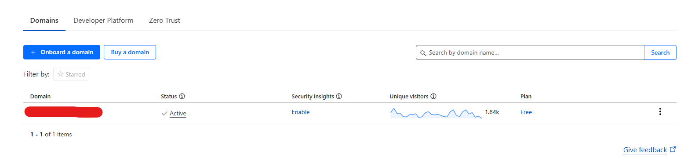
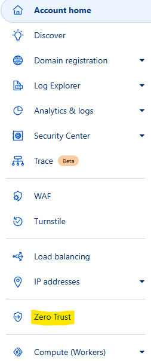
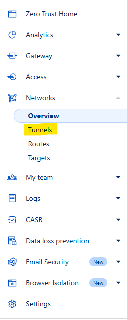
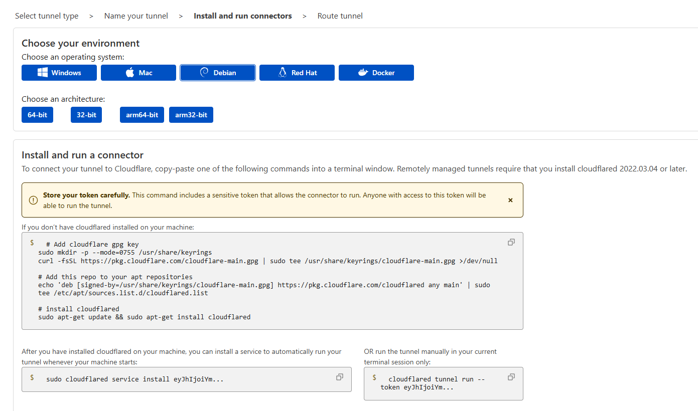
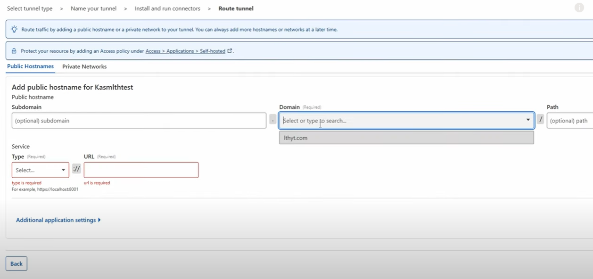
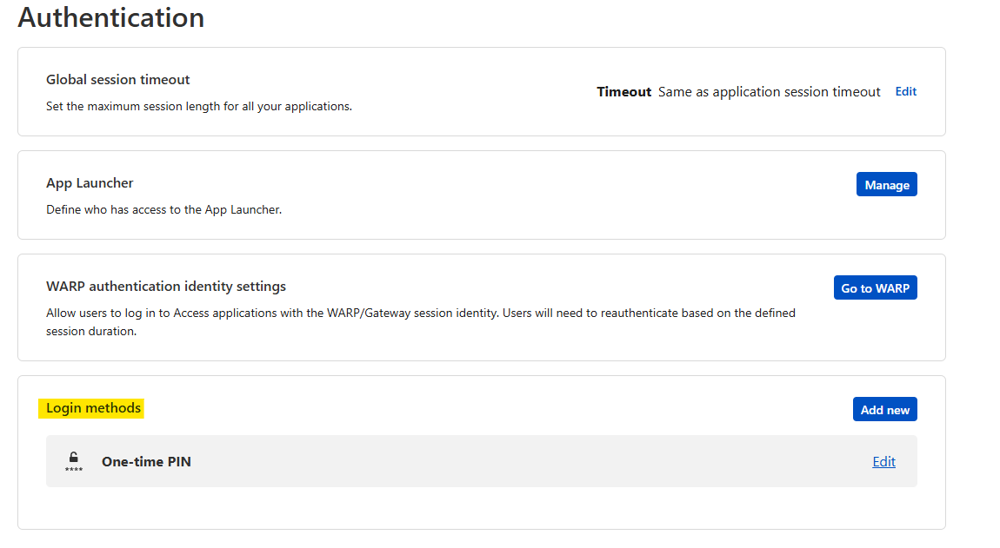
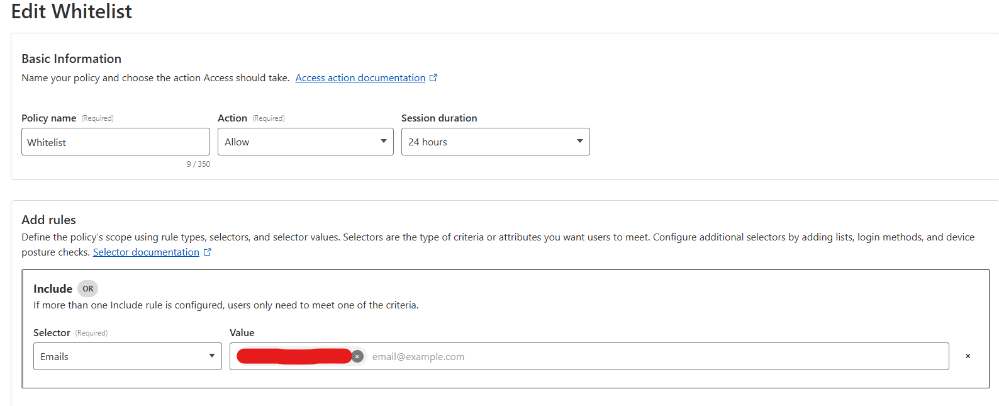
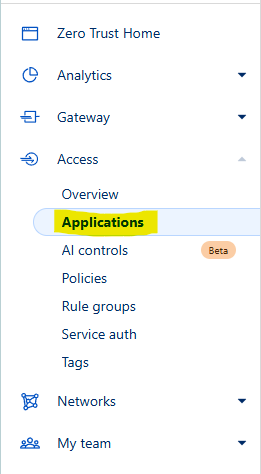
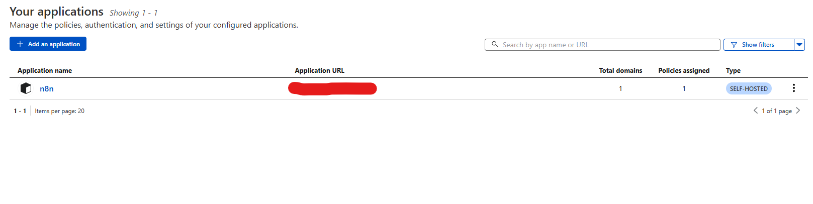
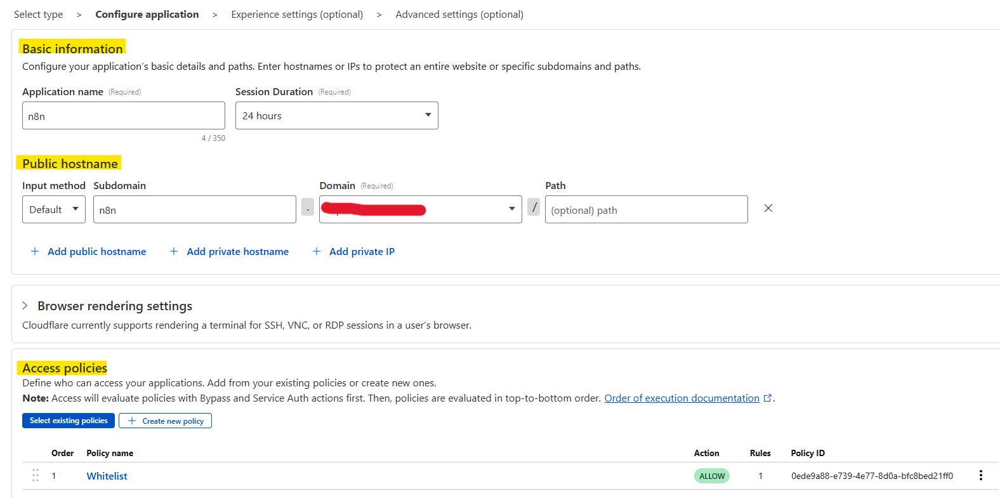

# Cloudflare Tunnel

Created by: Shadi A, September 23, 2025 6:27 PM

**Table of Contents**
1. [Introduction](#Overview)
2. [Cloudflare Tunnel](#What-is-a-Cloudflare-Tunnel)
3. [Tunnel Setup](#Tunnel-Setup)
   - [Creating a Cloudflare Account](#Creating-a-Cloudflare-Account)
   - [Adding a Domain](#Adding-a-Domain)
4. [Disclaimer](#Disclaimer)
5. [Securing Your Application with a Login Page](#Securing-Your-Application-with-a-Login-Page)
   - [Authentication](#Authentication)
   - [Policy Setup](#Policy-Setup)
   - [Application Setup](#Application-Setup)

# Overview

In this guide I will walk you through the steps I took to setup a Cloudflare tunnel to access my local n8n instance through a public domain. Doing so allows you to integrate services like Gmail, Telegram, or WhatsApp if your n8n instance is installed on a home server and cannot be accessed via localhost.

# What is a Cloudflare Tunnel

Simply put, a Cloudflare Tunnel is software installed on your machine that creates a secure connection to the Cloudflare network. Once connected, you can add a domain and map it to a device or application within your local network. This is especially useful for home labbers who want to expose internal services to the internet without opening ports or revealing their public IP address.

# Tunnel Setup

### Creating a Cloudflare Account

Firstly, you need to sign up to Cloudflare. You can do this by navigating to the [Cloudflare](https://dash.cloudflare.com/) website and clicking “sign-up.”

### Adding a Domain

After your account is created, you need to add a domain. You may either purchase a domain through Cloudflare or connect an already owned domain. Both of these actions can be found on the home page. 

***Note:**
If you're connecting a domain you already own, you'll need to update its **nameservers** to point to Cloudflare. Cloudflare will guide you through this process.*

### Creating a Tunnel

Now that your domain is added, you can create a tunnel by clicking on the “Zero Trust” link in the left side navigation menu. Once in the Zero Trust home, navigate to the “Networks” dropdown in the left side menu and click “Tunnels”.

**On the tunnels page:**

1. Click “Create a Tunnel”.
2. Select the “Cloudflared” method.
3. Name your tunnel, the name should be relevant.
4. Click “Save Tunnel”
5. Now you need to install the connector on the device with the service needing tunneling.

**On the Configuration Page:**

1. Select the operating system your service is running on (e.g. Debian).

1. Open a terminal on the device with the service.
2. Run the first set of commands on the configuration page within your terminal. This installs Cloudflared on your device.
3. Once complete, run the second command provided, this will run the tunnel and install a service to automatically run the tunnel every time your machine is rebooted.
4. If everything ran smoothly, you should now be able to click “Next” to connect your domain to your device.

**Route Tunnel Page:**

1. On this page, select your domain.
2. You can also add a subdomain (recommended if you have a specific service you need to connect to e.g. n8n, Portainer, Plex, etc.).
3. Select the type of traffic either http or https (HTTPS requires your domain to have an SSL certificate which can also be obtained through Cloudflare).
    1. **Important Note:** You can select HTTP here even if your public site uses HTTPS. Cloudflare handles the public-facing HTTPS encryption for you. This setting only determines how the tunnel connects to your local service on your private network, which is typically HTTP.
4. Type the private IP address of the device running Cloudflared and include the port of the service. (e.g. **192.168.4.114:5678** OR **localhost:5678**).

# Disclaimer

As convenient as it is to map your service to a public address, it does come with risk. While your server's IP is hidden, your service (e.g. n8n) login page is now exposed to the public internet.

**To improve security**, the next step is to protect your tunnel with **Cloudflare Access**. This is a free service that places a secure authentication screen in front of your n8n instance. You can require users to log in with a Google account, a one-time passcode sent to their email, or other methods before they can even see your login page. This ensures that only you and authorized users can access it.

# Securing Your Application with a Login Page

Now we'll place a secure login screen in front of your n8n instance using Cloudflare's free Access service.

### Authentication

Firstly, you’ll need to make sure OTP is added as an authentication method in your “Zero Trust” page.

1. On the left side bar of the “Zero Trust” page, click settings (At the very bottom).
2. Click on “Authentication”.
3. Make sure Login methods include “One-time PIN”, if not simply add it by clicking on “Add new”, then selecting it.

### Policy Setup

After you’ve verified that OTP is enabled, we need to create a Policy. This is to whitelist the emails we want to have access to our login page.

1. On the left side menu, click the “Access” drop down, then click on “Policies”.
2. Give your policy a name like “Whitelist”, select the action as “Allow”, and keep the “Session Duration” the default.
3. Under the “Add Rules” header, add an “Include” field.
4. Set the “Selector” option to “Emails”.
5. Under the “Value” header, add the emails you’d like to whitelist.
6. Create/Save the Policy.

### Application Setup

1. On the left side menu, click on the “Access” dropdown, then select “Applications”.
2. Here is where you’ll tell Cloudflare where to find the Application you want to protect.

1. Click on “Add Application”, then select “Self-Hosted”.

1. Under the “Basic Information“ block, give your application a name e.g. n8n. Keep the duration set to default.
2. Click on “Add a public hostname” and add your domain. (include subdomain if you created one earlier).
3. Under the “Access Policies” block, click on “Select existing policies” then select the policy we created earlier.

1. Skip “Experience Settings” and “Advanced Settings”.
2. Save your application. You’re Done!!

Now that you’ve setup OTP, when you try to access your domain, you will be prompted to input an OTP.
